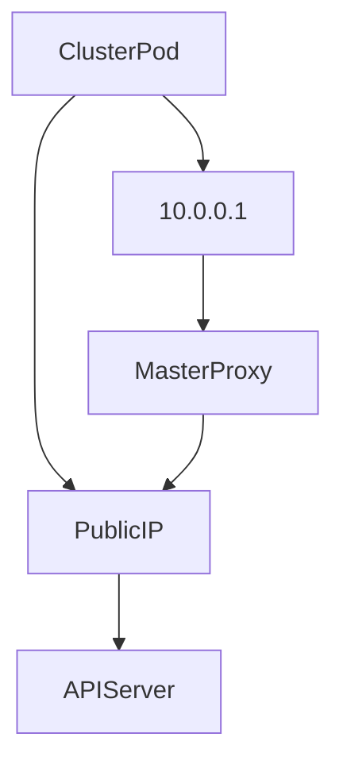

# Kubernetes Master Proxy
This service rewrite incoming "default/kubernetes" service packets into public API Gateway. It must be installed on eatch cluster nodes.

### Technical diagram of the MasterProxy

_Diagram legend_:

| Name        | Description                                                               |
|-------------|---------------------------------------------------------------------------|
| ClusterPod  | A Kubernetes pod running inside the cluster                               |
| 10.0.0.1    | Default Kubernetes API service (eg. kubernetes.default.svc.cluster.local) |
| MasterProxy | Kubernetes Master Proxy                                                   | 
| PublicIP    | Kubernetes ControlPlane public API IP address                             |
| APIServer   | Kubernetes ControlPlane APIServer service                                 |