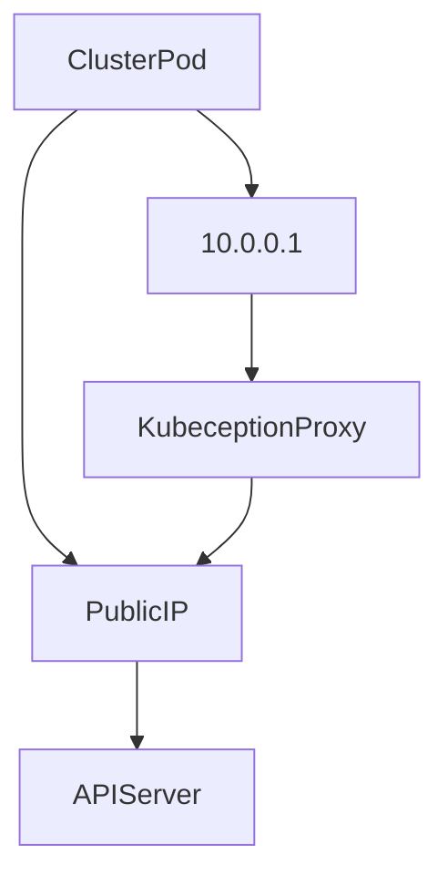

# Kubernetes "Kubeception" Proxy
This service rewrite incoming "default/kubernetes" service packets into public API Gateway. It must be installed on eatch cluster nodes.

### Technical diagram of the kubeception-proxy

_Diagram legend_:

| Name             | Description                                                               |
|------------------|---------------------------------------------------------------------------|
| ClusterPod       | A Kubernetes pod running inside the cluster                               |
| 10.0.0.1         | Default Kubernetes API service (eg. kubernetes.default.svc.cluster.local) |
| KubeceptionProxy | Kubernetes "Kubeception" Proxy                                            | 
| PublicIP         | Kubernetes ControlPlane public API IP address                             |
| APIServer        | Kubernetes ControlPlane APIServer service                                 |